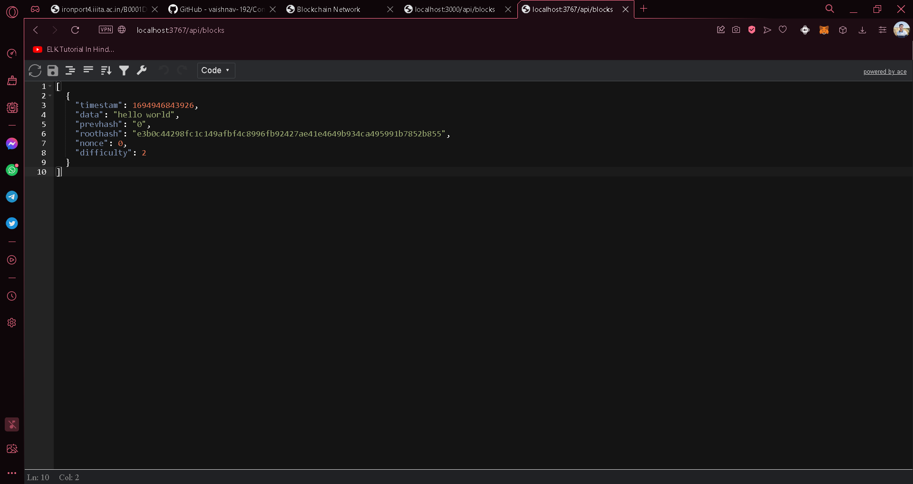

# ConnectChain
Welcome to the ConnectChain Application README! This document will provide you with essential information about the project, its features, how to set it up, and how to use it.

  The ConnectChain Application is a decentralized messaging platform that leverages blockchain technology to ensure privacy and security while allowing users to communicate with each other without disclosing their identities. It uses a publish-subscribe model implemented with Redis, a popular in-memory data store, to facilitate real-time messaging.

  
  ## features:
  
  <ul>
    <li>Anonymous Messaging: Users can send and receive messages without revealing their identities.</li>
    <li>Blockchain Encryption: Messages are encrypted and stored on a blockchain, ensuring data integrity and security.</li>
    <li>Real-time Communication: The publish-subscribe model allows for instant message delivery.</li>
    <li>User-Friendly Interface: The application provides an easy-to-use chat interface.</li>
  </ul>

  
  ## Installation:
  
  

	  <ul>
		  <li>start by cloning the repo:</li>
    
    git clone https://github.com/vaishnav-192/ConnectChain
    cd ConnectChain
      
  <li>install dependencies:</li>
    
    npm install
    
  <li>run the redis_server from ~/redis/redis_server</li>
  make sure to keep redis_server running in background.
   
  <li>To fire-up the U.I:</li>
    
    python -m http.server
    
  <li>open browser and go to: http://localhost:8000 </li>
  <li>open "indexx.html"</li>
   
  

  </ul>

  

  

 ## Staring up the application

 <ul>
	 <li>If you are the host of the network:</li>
	
	 npm run dev

<li>If u are a peer:</li>

	npm run dev-peer

<li>If you notice console will give you a port number. For example</li>
	If you are the host:

	
 If you are peer:
 
 

 <li>Notice that port number for a peer will be generated by rand() function</li>
 <li>You can view your endpoint at 
	 
	http://localhost:{your port number}/api/blocks
  </li>
Examples:
If you are host:

If you are peer:

 ## Adding data
 <ul>
<li>Adding data into blockchain

  

</li>

Data gets added to the peer also:
 

<li>New Blockchainreplace by nodes:

</li>

 </ul>

 ## Stats:
 <ul>
	 <li>For monitoring Stats/Networking of application we can use Prometheus:

  
</li>
<li>Instruction on, how to install prometheus and monitoring networking, refer to:</li>

<a href="//prometheus.io" target="_blank">prometheus.io</a>
 </ul>

